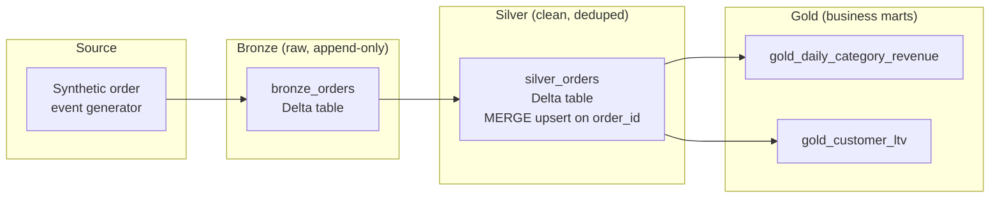

# Databricks Lakehouse Demo

A self-contained medallion-architecture pipeline on Databricks: synthetic
e-commerce order events flow through **bronze → silver → gold** Delta Lake
tables, orchestrated as a Databricks Job and deployed with a **Databricks
Asset Bundle**. No external API keys or datasets are required — the pipeline
generates its own synthetic data, so anyone can clone this repo and run it
end to end on a free Databricks workspace.

## Why this exists

This is a portfolio piece demonstrating:

- **Delta Lake / medallion architecture** — append-only bronze log, MERGE-based
  dedup into silver, aggregated gold marts.
- **PySpark data engineering** — schema enforcement, window functions, upserts,
  business aggregations.
- **Databricks Asset Bundles (DABs)** — infrastructure-as-code for jobs,
  clusters, and schedules, deployable to dev/prod targets.
- **CI/CD for a data platform** — GitHub Actions lints and unit-tests the
  transformation logic (via local PySpark + Delta, no workspace needed) on
  every PR, and optionally validates the bundle against a real workspace.
- **Repo hardening** — branch protection on `main`/`dev` (required status
  checks, no force-push/deletion), GitHub Actions pinned to commit SHAs,
  least-privilege `permissions: contents: read` on every workflow, Dependabot
  for `pip` and Actions, and secret scanning with push protection enabled.
  See `SECURITY.md`.

## Architecture



| Layer  | Table                          | What happens                                                                 |
|--------|---------------------------------|-------------------------------------------------------------------------------|
| Bronze | `bronze_orders`                 | Raw event append, including simulated duplicate replays (at-least-once delivery) |
| Silver | `silver_orders`                 | Data-quality filter (non-null keys, positive qty/price, valid status) + `MERGE` dedup to latest event per `order_id` |
| Gold   | `gold_daily_category_revenue`    | Revenue, order count, avg order value by day + category                       |
| Gold   | `gold_customer_ltv`              | Lifetime value and order count per customer                                   |

All four tables are real **Unity Catalog managed tables** (`catalog.schema.table`,
written via `saveAsTable`/`DeltaTable.forName`) — not files sitting under a
Volume path. Unity Catalog Volumes are for unstructured/arbitrary files and
can't back a SQL table's `LOCATION`, so the pipeline lets UC own storage for
every layer instead.

## Repo layout

```
├── src/lakehouse/          # Transformation logic, unit-testable outside Databricks
│   ├── data_generator.py   # Synthetic order event generator
│   ├── bronze.py
│   ├── silver.py
│   └── gold.py
├── notebooks/              # Databricks notebooks (import directly into a workspace)
│   ├── 01_bronze_ingest.py
│   ├── 02_silver_clean.py
│   └── 03_gold_aggregate.py
├── tests/                  # pytest suite using local PySpark + Delta (no cluster needed)
├── databricks.yml          # Asset Bundle definition (dev/prod targets)
├── resources/jobs.yml      # Job + cluster + schedule definition
└── .github/workflows/      # CI: lint + test on every PR, bundle validate against a workspace
```

## Running the tests locally

The transformation logic in `src/lakehouse/` is plain PySpark and runs
against a local Spark session with `delta-spark`, so the whole test suite
runs without any Databricks workspace:

```bash
python -m venv .venv && source .venv/bin/activate
pip install -r requirements.txt
pip install -e .
pytest -v
```

## Deploying to a Databricks workspace

1. [Install the Databricks CLI](https://docs.databricks.com/dev-tools/cli/install.html)
   and authenticate: `databricks configure`.
2. Edit `databricks.yml` and replace `<your-workspace-host>` with your
   workspace URL.
3. Validate and deploy the bundle:

   ```bash
   databricks bundle validate -t dev
   databricks bundle deploy -t dev
   ```

4. Run the pipeline once on demand, or unpause the schedule in
   `resources/jobs.yml` for it to run daily:

   ```bash
   databricks bundle run medallion_pipeline -t dev
   ```

5. Check the results in your workspace's Catalog Explorer under
   `main.lakehouse_demo` (or whatever `catalog`/`schema` you configured), or
   query the gold tables directly:

   ```sql
   SELECT * FROM main.lakehouse_demo.gold_daily_category_revenue ORDER BY order_date DESC;
   ```

## Running notebooks ad hoc against a live workspace

Outside of a bundle-deployed job (where the wheel library makes `lakehouse`
importable normally), each notebook falls back to adding this repo's `src/`
to `sys.path` if the package isn't installed — see the `try`/`except
ModuleNotFoundError` block at the top of each notebook. This lets you run
them directly against a Git-folder-synced repo on any cluster (including
serverless), with no wheel build or `%pip install` required.

One gotcha when iterating this way: once a notebook session has imported
`lakehouse.*` once, Python caches it in `sys.modules`. Pulling new commits
into the Git folder and re-running the notebook **will not** pick up the
change — you're still running the previously-imported, now-stale module in
memory. Run `%restart_python` after every `git pull` before re-running, or
the notebook will silently execute old code.

## Design notes

- **Why synthetic data instead of a public dataset?** So the repo has zero
  external dependencies to run — no API keys, no downloads, no rate limits.
  The generator also intentionally injects duplicate/replayed events, which
  is what makes the silver-layer `MERGE` dedup logic meaningful to look at
  rather than a no-op.
- **Why unit-test with local PySpark instead of mocking Spark?** The
  transformation functions in `src/lakehouse/` take and return DataFrames and
  don't reference `dbutils` or workspace-specific paths, so they're testable
  with a local `SparkSession` + `delta-spark` — the same approach you'd use to
  keep a real Databricks project's core logic CI-testable without a live
  cluster.
- **Why a wheel library instead of `%pip install -e .` in notebooks?** The
  Asset Bundle builds `src/lakehouse` into a wheel and attaches it as a job
  cluster library (see `databricks.yml` / `resources/jobs.yml`), which is the
  production-recommended pattern for shipping shared logic to multiple
  notebooks/tasks reproducibly.
- **Why is `unit_price` a `decimal(10,2)`, not a `double`?** Currency stored
  as a binary float accumulates rounding drift once you sum enough rows —
  `gold_customer_ltv.lifetime_value` visibly showed it (`6483.709999999999`
  instead of `6483.71`) before this was fixed. `bronze.py` casts `unit_price`
  to `DecimalType(10, 2)` at ingestion, and every downstream sum/multiply
  stays exact because it's decimal arithmetic the whole way through.
- **Data-quality filters in `silver.clean_bronze`**: non-null `order_id` and
  `customer_id`, positive `quantity`/`unit_price`, a known `status`, and a
  deterministic tiebreaker (`ingested_at` descending) when two replayed
  events share an identical `event_time` — without it, dedup would pick an
  arbitrary winner on each run instead of the actual latest replay.
